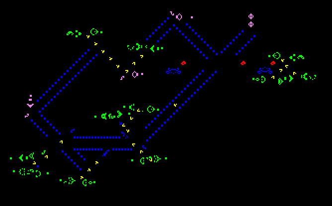

# Game of Life

## Description

Available [here](http://codingdojo.org/kata/GameOfLife/)

### What is Bottom-up and Top-down TDD?

Bottom-up style is when you build a brick outside your main acceptance test flow and only later integrate it
with the rest of the program. On the contrary, Top-down style is when you only work on the code that is covered
by the acceptance or high level tests.

In order to experiment full bottom-up style start the kata with 10 minutes of up-front design and come up with the
different 'bricks' you will need to solve the problem. Then use the bottom-up way to solve the kata:

1. Write an acceptance test, and comment it
2. Test drive the implementation of each brick
3. Using all the bricks, test drive the implementation of the main function
4. Uncomment and pass your acceptance test

_Note: Bottom-up / Top-down are also known as Inside-out / Outside-in_

### The pros of Bottom-up TDD?

* It lets you work in small steps
* It tends to result in more reusable and robust bricks

### The cons of Bottom-up TDD?

* There is a risk that the brick does not integrate well with the main code, leading to a lot of rework. Then a good recommendation is to integrate the brick as soon as possible in the main code.
* Creating a robust brick is often more work than necessary for the current acceptance test

## Session Quick Retrospective

You can fill it from [here](./QuickRetrospective.md)

## Useful Links

### For this Kata

* [Wikipedia - Conway's Game of Life](https://en.wikipedia.org/wiki/Conway%27s_Game_of_Life)
* [Conway's Game of Life online editor](https://tebs-game-of-life.com/conways-editor/conways-editor.html)
* [TDD - From the Inside Out or the Outside In?](https://8thlight.com/blog/georgina-mcfadyen/2016/06/27/inside-out-tdd-vs-outside-in.html) by Georgina McFadyen

### General

* Handy for any type of turn-based session: [Online Timer](https://agility.jahed.dev/)
* [Coaching Plan Wiki Page](https://mxwiki.murex.com/confluence/display/DEVS/%5BXP+Coaching%5D+A+Kata+Plan+to+go+from+learning+TDD+to+refactoring+existing+code)

## Session Information

### Style & Duration

- 2-hour [Randori Kata](./doc/RandoriKata.md)

### Topic

Bottom-up TDD

### Focus Points

* Test readability
* Teamwork
* ⚠ YAGNI

### Source Files

## License

The `Kata-GameOfLife` and the accompanying materials are made available
under the terms of the MIT License ([here](LICENSE.md)) which accompanies this
distribution, and is available at the Open Source site [here](https://opensource.org/licenses/MIT)

## Acknowledgements

See [ACKNOWLEDGEMENTS.md](./ACKNOWLEDGEMENTS.md) for more information.

## Contributors

<table>
<tr>
    <td align="center" style="word-wrap: break-word; width: 150.0; height: 150.0">
        <a href=https://github.com/mengdaming>
            
             
            <b>Damien Menanteau</b>
        </a>
    </td>
    <td align="center" style="word-wrap: break-word; width: 150.0; height: 150.0">
        <a href=https://github.com/aatwi>
            
             
            <b>Ahmad Atwi</b>
        </a>
    </td>
    <td align="center" style="word-wrap: break-word; width: 150.0; height: 150.0">
        <a href=https://github.com/philou>
            
             
            <b>Philippe Bourgau</b>
        </a>
    </td>
</tr>
</table>
